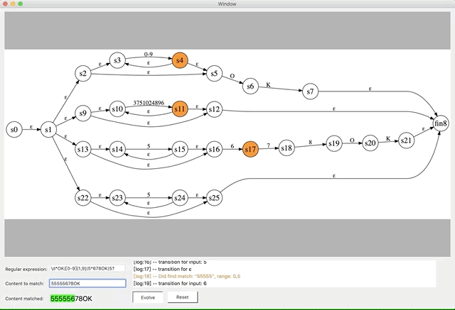

## Why this project:
When I was reading [The Dragon Book](https://en.wikipedia.org/wiki/Compilers:_Principles,_Techniques,_and_Tools), I found concepts like NFA/DFA and regular expression are fundamental to computer science. However, they are difficult to understand, especially the part NFA simulating DNA to achieve regular expression matching is too abstract. At that time, it was of a great help if there were a tool to visually reveal the principles behinds those concepts. 

There are already some great implementations online which converts regular expressions to railway graph. For example: https://regexper.com/ But those implementations lack the feature to show state transitions, which is a major feature of Visual-Regular-Expression. This project uses its swift-written parsing engine to convert regular expressions to NFAs. And it show every step in the process of matching.

I believe Visual-Regular-Expression is an efficient tool to learn NFA and regular expressions.

## 为什么写这个项目:
在我阅读[龙书](https://en.wikipedia.org/wiki/Compilers:_Principles,_Techniques,_and_Tools)的过程中，我意识到NFA和正则表达式是计算机科学很重要的根基。
然而，我发现NFA的概念很难理解，尤其是NFA模拟DNF以达成正则匹配的部分，更是太过抽象。如果能有一个工具以视觉的方式向我展示这一过程，我一定会更好地理解NFA和正则。

网上已有一些优秀的实现将正则表达式转化成铁路图，例如 https://regexper.com/ 但它们缺乏动态展示状态流转的过程，而Visual-Regular-Expression正补上了这一环。本项目使用一个swift实现的正则解析引擎，将解析结果转换成NFA，并动态展示每一步的匹配过程。

我相信Visual-Regular-Expression是一个帮助学习NFA和正则的高效工具。

## Acknowledgments

1. No greedy mode
2. Its grammar is more strict. For example, any thing between "[]" is considered literal except "-", which must be escaped if a literal "-" is to be matched.
3. If there is any syntax error, make sure your pattern string is valid for https://regexr.com/
4. Please let me know if this app is letting your down in any way. jinhao.zhang@icloud.com
5. I learned these shits from [The Dragon Book](https://en.wikipedia.org/wiki/Compilers:_Principles,_Techniques,_and_Tools)
6. This project is heavily inpired by the work of [Russ Cox](https://swtch.com/~rsc/). One lost soul (like me) can find some great articles about regular expression from [Regular Expression Matching Can Be Simple And Fast](https://swtch.com/~rsc/regexp/regexp1.html)
7. This project is also a good example of using [Graphviz](https://www.graphviz.org/) as a c-library in your project. Many thanks to people behind Graphviz.

## 声明

1. 不支持贪婪模式
2. Visual-Regular-Expression的正则语法更严格。比如，[]中间的特殊符号仅支持‘-’
3. 如果你收到任何语法错误的提示，可以前往 https://regexr.com/ 验证你的输入
4. 对此repo有任何问题，欢迎联系我jinhao.zhang@icloud.com
5. 我从龙书中学习到所有这些知识 [The Dragon Book](https://en.wikipedia.org/wiki/Compilers:_Principles,_Techniques,_and_Tools)
6. 这个项目的很多启发来源于 [Russ Cox](https://swtch.com/~rsc/) 的优秀工作结果。若有人对正则表达式方面有疑问，你都可以在这里找到很多有帮助的资料 [Regular Expression Matching Can Be Simple And Fast](https://swtch.com/~rsc/regexp/regexp1.html)
7. 本项目也是一个使用 [Graphviz](https://www.graphviz.org/) 作为C库的实现案例。向维护 Graphviz 的人致敬与感谢

## Getting Started

clone this repo to your folder.

open RegSwiftProject.xcworkspace with Xcode.

run MacApp target.

## 使用方式

将本repo clone到你本地的文件夹

使用Xcode打开 RegSwiftProject.xcworkspace 工程

运行MacApp

## Authors

*Initial work* - [White](https://github.com/White-White)  email: jinhao.zhang@icloud.com

## License

This project is licensed under the MIT License - see the [LICENSE](LICENSE) file for details

